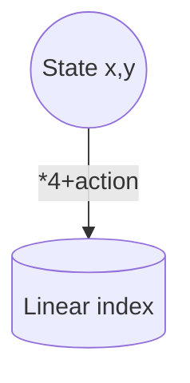
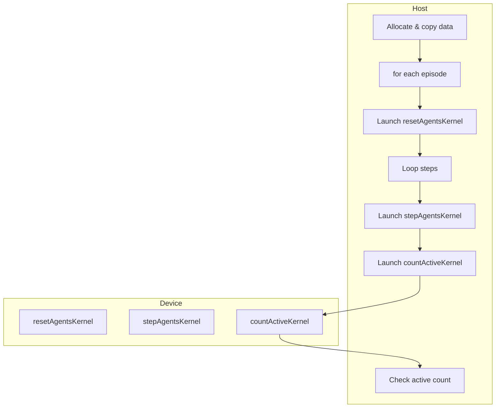

# Deep Dive into Multi-Agent Q-Learning CUDA Project

## Overview

This document explores in depth the C++ and CUDA implementations of single- and multi-agent Q-learning found in this repository. The project simulates a grid-world environment where agents learn to navigate from start `(0,0)` to a goal (`flag_x`, `flag_y`) while avoiding mines. Implementations exist in Python, C++, and CUDA; this document focuses solely on the C++ and CUDA code.

The core idea of Q-learning is to maintain a table `Q[s,a]` representing the expected return for taking action `a` in state `s`. The table is updated iteratively using:

```
Q[s,a] ← Q[s,a] + α [ r + γ max_a' Q[s',a'] - Q[s,a] ]
```

where `α` is the learning rate and `γ` the discount factor. The environment is discrete with four possible actions (up, down, left, right). Each implementation stores the Q-table as a three‑dimensional array `[size][size][4]`.

---

## C++ Single-Agent Implementation

### GridWorld Class
The single-agent environment is encapsulated by `GridWorld` defined in `single_agent.cpp`. The constructor initializes a square grid, places mines, and stores the flag location. Mines are stored in `std::vector<std::pair<int,int>>` while the grid itself is a 2‑D vector of ints. Relevant lines include the class definition and constructor:
```cpp
class GridWorld {
public:
    GridWorld(int size, int n_mines, std::pair<int,int> flag_pos)
        : size(size), n_mines(n_mines), flag_pos(flag_pos), state({0,0}) {
        grid.resize(size, std::vector<int>(size, 0));
        std::srand((unsigned)std::time(nullptr));
        placeMines();
    }
```
Referenced from lines 11‑20 of `single_agent.cpp`.

Key methods:
* `placeMines()` randomly fills the grid with `-1` markers representing mines.
* `reset()` resets the agent state to `(0,0)`.
* `step(action)` moves the agent, returns `(next_state, reward, done)`.
* Helper methods `isMine()` and `isFlag()` for policy rendering.

### QLearningAgent
The agent maintains the Q-table and learning parameters. The Q-table is a vector indexed `[x][y][action]`.
```cpp
std::vector<std::vector<std::vector<double>>> Q;
```
Functions of interest:
* `chooseAction(state)` uses ε-greedy policy.
* `update(state, action, reward, next_state)` performs the Q-learning update.
* `train(episodes)` runs the training loop.
* `bestAction(x,y)` used when printing or visualizing the learned policy.
* `visualizePolicyGIF()` draws frames with Magick++ and saves a GIF.

### Main Function
The executable parses command-line arguments, constructs `GridWorld` and `QLearningAgent`, trains, prints the policy, and optionally renders a GIF. Parameter defaults are documented in the README.

---

## C++ Multi-Agent Implementation

The multi-agent version generalizes the environment and agent classes.

### MultiAgentGridWorld
This class holds grid information plus per-agent state arrays:
```cpp
std::vector<std::pair<int,int>> agent_states_;
std::vector<bool> active_agents_;
```
`reset()` places all agents back at `(0,0)` and marks them as active. `step(agent_id, action)` handles movement and deactivates an agent if it hits a mine or reaches the flag.

### MultiAgentQLearningAgent
`q_table_` has the same shape as in the single-agent case. The `train()` loop iterates through agents each episode, letting active agents act until fewer than 20% remain. The `visualizePolicyGIF()` method draws a GIF by iterating over agents simultaneously.

---

## CUDA Single-Agent Implementation

The CUDA version runs many episodes in parallel by mapping each episode to one thread. Device constants and arrays are declared as follows:
```cpp
__device__ __constant__ int d_SIZE;
__device__ __constant__ int d_N_MINES;
__device__ __constant__ int d_FLAG_X;
__device__ __constant__ int d_FLAG_Y;
__device__ __constant__ float d_ALPHA;
__device__ __constant__ float d_GAMMA;
__device__ __constant__ float d_EPSILON;
__device__ __constant__ int d_MAX_STEPS;

__device__ int d_grid[1024*1024];
__device__ float d_Q[1024*1024*4];
```
These appear around lines 29‑39 of `single_agent.cu`【F:single_agent.cu†L29-L39】.

### Random Number Generation
A lightweight LCG is defined in `curandStateSimple` and `deviceRand()` to avoid heavy `curand` usage. Each thread gets its own state stored in global memory (`d_randStates`).

### Kernels
`runEpisodesKernel` performs the training loop for a slice of episodes per thread. Inside each step it chooses an action using `chooseActionDev`, updates the agent position, computes the reward, and performs an atomic Q-table update via `atomicUpdateQ` (lines 41‑56)【F:single_agent.cu†L41-L56】.

Key section from the kernel:
```cpp
while(!done && steps < d_MAX_STEPS) {
    steps++;
    int action = chooseActionDev(x, y, d_EPSILON, &localState, size);
    int oldX = x;
    int oldY = y;
    stepDev(x, y, action, size);
    ...
    float tdTarget = (float)reward + (isDone ? 0.0f : (d_GAMMA * bestNext));
    atomicUpdateQ(oldX, oldY, action, tdTarget, d_ALPHA, size);
    done = isDone;
}
```
from lines 98‑131 of `single_agent.cu`【F:single_agent.cu†L98-L131】.

### Host Setup
The host allocates and copies the grid and Q-table to the GPU, launches `runEpisodesKernel`, then copies results back. Example lines:
```cpp
CHECK_CUDA(cudaMemcpyToSymbol(d_SIZE, &size, sizeof(int)));
CHECK_CUDA(cudaMemcpyToSymbol(d_N_MINES, &n_mines, sizeof(int)));
...
runEpisodesKernel<<<blocks, threads_per_block>>>(episodes, d_randStates);
```
shown around lines 320‑349 of `single_agent.cu`【F:single_agent.cu†L320-L349】.

Visualization and policy printing are handled on the CPU using the data copied back from device memory.

---

## CUDA Multi-Agent Implementation

### Device State
The multi-agent CUDA code stores environment and agent state in global memory pointers set via `cudaMemcpyToSymbol`:
```cpp
__device__ int* d_grid;
__device__ float* d_Q;
__device__ int* d_active;
__device__ int* d_agentX;
__device__ int* d_agentY;
```
followed by scalar parameters such as `d_SIZE`, `d_N_AGENTS`, and learning hyperparameters (lines 29‑44)【F:multi_agent.cu†L29-L44】.

### Kernels
Four kernels orchestrate learning:
1. `resetAgentsKernel` initializes agent positions and active flags (lines 68‑76)【F:multi_agent.cu†L68-L76】.
2. `stepAgentsKernel` executes one step of ε-greedy action selection and atomic Q-table update for each active agent (lines 78‑143)【F:multi_agent.cu†L78-L143】.
3. `countActiveKernel` tallies active agents via shared memory reduction (lines 146‑162)【F:multi_agent.cu†L146-L162】.
4. `initRandKernel` seeds each agent’s RNG state (lines 164‑170)【F:multi_agent.cu†L164-L170】.

The Q-update logic is very similar to the single-agent kernel but must handle many agents concurrently. Atomic updates ensure all agents safely write to the shared Q-table.

### Host Control Flow
On the host side, memory for the grid, Q-table, and agent arrays is allocated and copied to the device. The code then launches initialization and training loops:
```cpp
initRandKernel<<<gridDims, blockDims>>>(d_randStates, seed);
for(int ep = 0; ep < episodes; ep++) {
    resetAgentsKernel<<<gridDims, blockDims>>>();
    ...
    while(stepCount < max_steps_per_episode) {
        stepAgentsKernel<<<gridDims, blockDims>>>(d_randStates, d_done);
        countActiveKernel<<<gridDims, blockDims>>>(d_countActive);
        ... stop when too few agents remain ...
    }
}
```
These sections correspond to lines 421‑459 of `multi_agent.cu`【F:multi_agent.cu†L421-L459】.

After training, the Q-table is copied back for printing and optional GIF rendering.

### Visualization
`visualizePolicyGIF` in `multi_agent.cu` renders frames based on the learned policy for a single agent for clarity. The function iteratively consults the Q-table to move a virtual agent and paints each frame via Magick++ (lines 219‑305)【F:multi_agent.cu†L219-L305】.

---

## Data Structures and Memory Layout

### Q-Table
The Q-table is always a contiguous 1‑D array in CUDA (`float d_Q[size*size*4]`) or a nested `std::vector` in C++. The index formula `(x * size + y) * 4 + action` maps a `(x,y,action)` triple to a flat array index. This layout enables coalesced memory access when consecutive threads update neighboring Q-values.

### Grid Representation
The grid is a 2‑D array of integers with `-1` representing a mine, `0` otherwise. In the CUDA code the grid is flattened for simple indexing.

### Agent State
For the multi-agent CUDA version, per-agent arrays `d_agentX`, `d_agentY`, and `d_active` track position and alive/dead status. Host equivalents exist for initialization and final copy-back. The state arrays are sized by `n_agents` and updated each kernel launch.

### Random Number Generation
Both CUDA files implement a small linear congruential generator in device code to avoid the heavier `curand` library. Each thread/agent keeps a `seed` which is updated with the multiplier `1103515245` and increment `12345` each call, producing a 31-bit pseudo-random value.

### Atomic Updates
Because multiple threads/agents may attempt to update the same Q-table entry simultaneously, CUDA device code uses custom atomic compare-and-swap loops to update floating point values safely. This is encapsulated in `atomicUpdateQ` (single-agent lines 41‑55 and multi-agent lines 47‑61) ensuring consistent Q-values across threads.

---

## Performance Considerations

* **Parallel Episodes:** In `single_agent.cu` each thread runs a subset of episodes independently, allowing thousands of episodes to be executed simultaneously on the GPU.
* **Concurrent Agents:** In `multi_agent.cu` each agent corresponds to a GPU thread during every step, so hundreds of agents learn simultaneously while sharing a global Q-table.
* **Constant Memory:** Hyperparameters are stored in device constant memory for fast access by all threads.
* **Atomic Operations:** Q-table updates use CAS loops to prevent race conditions when multiple agents update the same entry.
* **Minimal RNG:** The homegrown RNG avoids expensive library calls, trading some randomness quality for speed.
* **Batch Copies:** Host-to-device copies occur only at setup and after training, minimizing PCIe traffic.

---

## Diagrams

### Q-table Indexing


### Multi-Agent CUDA Flow


---

## Conclusion

The project demonstrates how classic Q-learning can be accelerated using GPU parallelism. By structuring the environment as simple arrays and performing atomic updates, both single and multi-agent variants leverage CUDA to run many agents or episodes concurrently. The provided C++ versions mirror the logic for clarity and easier debugging, while the CUDA code focuses on parallel kernels and efficient memory usage. This document has detailed the key data structures and flow of control so that anyone can understand and extend the implementation.

